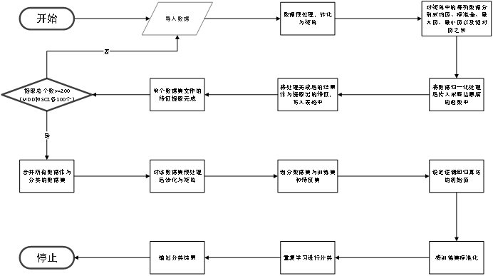

# 基于信息熵和逻辑回归的特征提取分类

## 项目概述
- 要求：<u>对给定数据集，完成分类任务。</u>对数据进行特征提取，然后选用任意一种算法进行交叉验证，最后对结果进行分析。
- 思路：使用**信息熵算法**完成特征提取，使用**逻辑回归算法**进行数据分类

## 流程概述
1. 首先进行数据集的特征选择，导入数据之后通过np.array()函数转化为适用于numpy标准的二维矩阵。
2. 因为单个数据文件是同一对象的生物信息，因此对矩阵中的每列数据分别求均值、标准差、最大值、最小值、数据绝对值之和。
3. 在归0，1化处理后导入计算信息熵的函数中求信息熵，将运算结果合同之前的几个值作为该数据的特征，写入表格。
4. 之后将完成特征提取后的100个MDD和100个SCZ数据合并作为分类的数据集，导入之后进行预处理，将数据集划分为训练集和特征集。
5. 完成逻辑回归的初始化，包括Sigmoid函数设置等步骤之后，对训练集重复学习。
6. 对测试集进行分类，输出结果。

程序流程图如下：

## 结果分析
- 从结果而言，编写的程序一定程度上完成了对训练集分类的要求，但明显存在部分错误，对某些点的分类产生误判，但总体情况而言达到预期，通过一系列处理实现了对数据集的特征提取和分类。
- 编写的程序仍有较大提升空间，如批量处理文件、一体化实现特征提取及分类以及进一步提升分类准确性等，在后续研究中可以继续钻研探索。